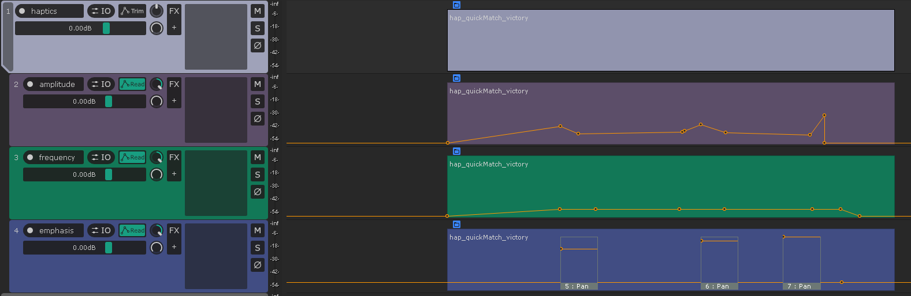
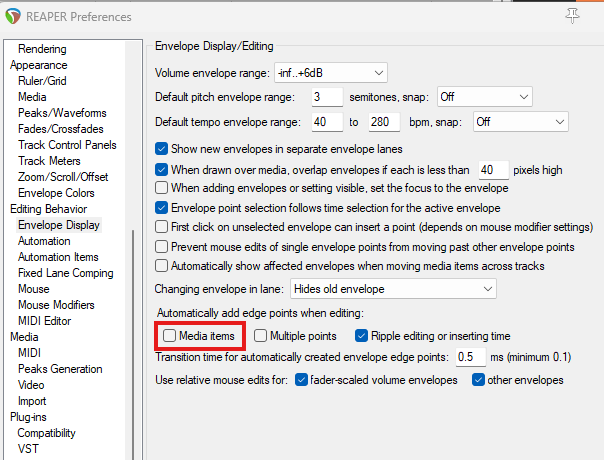
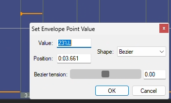
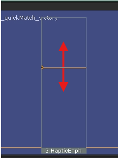
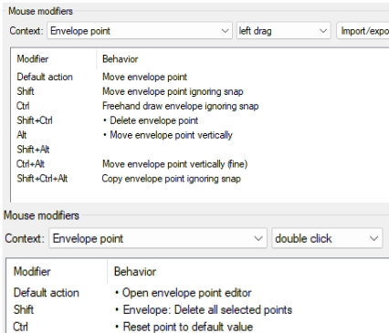
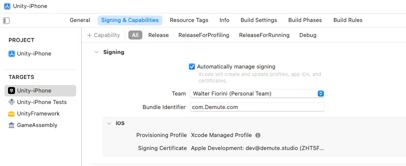

# REAHAPTICC (Reaper Haptics Creator)
---

REAHAPTIC is package for reaper that contains a collection of scripts that allows the creation, editing, exporting and testing of haptic files all inside Reaper(currently focused on haptics for mobile) and comes with a mobile testing app called the Reahaptic Receiver.

The goal of this project is to make haptic creation and testing for games as a sound designer as easy and efficient as possible. These are the requirements for this project:
- **Immediate feedback**: when creating a haptic file we want to be able to test it immediately without having to export a file, on both mobile and gamepads.
* **workflow**: A comfortable haptics creation workflow that can coexist with sound design in the same reaper project.
* **Format agnostic**: we should be able to export as all main haptic formats, so we are not tied to a specific implementation, and we could also serve as a conversion tool.

## Installing Reahaptic:
---
### Requirements:
- **Reaper**: Package was made for reaper 7.22+ but should work for older versions as well.
- **Reapack** : used to import the package in reaper
- **Python**: some of the scripts are in python, so make sure your reaper has a recognised python installation. You can check this here: **options >preferences >Plug-ins >ReaScript**
- **ReaImGui**: Used for the menu’s, Is included in the ReaTeam Extensions Package that you can install with Reapack. To check if it is installed, you should have a ReaImGui Tab under the ReaScript tab in the preferences: **options >preferences >Plug-ins >ReaImGui** 

### Reapack:
To install Reapack follow these steps:
1. Download Reapack for your platform here(also the user Guide): [Reapack Download](https://reapack.com/user-guide#installation)
2. From REAPER: **Options > Show REAPER resource path in explorer/finder**
3. Put the downloaded file in the **UserPlugins** subdirectory
4. Restart REAPER. Done!

If you have Reapack installed go to **Extensions->Reapack->Import Repositories** paste the following link there and press **Ok**.
https://raw.githubusercontent.com/FlorianHeynen/ReaHaptic/refs/heads/main/index.xml
Then in **Extensions->Reapack->Manage repositories** you should see **ReahapticScripts** double click it and then press **Install/update ReahapticScripts** and choose **Install all packages in this repository**. It should Install without any errors.

To install **ReaImGui**, find **ReaTeam Extensions** in Manage repositories. Then if you only want ReaImGui Choose **Install individual packages in this repository** and find ReaImGui.

### Action List:
These Actions should appear in your action list
1. ReaHaptic_Settings.lua
2. ReaHaptic_CreateTracks.py
3. ReaHaptic_InsertEmptyHaptic.py
4. ReaHaptic_ItemController.lua
5. ReaHaptic_InsertEmphasis.py
6. ReaHaptic_DeleteSelectedHaptics.lua
7. ReaHaptic_RenameItems.lua
8. ReaHaptic_Export.lua
9. ReaHaptic_Importer.py
10. ReaHaptic_InstantSender.lua
11. ReaHaptic_ContinuousSender.lua

### Importing Toolbar:
To easily use these actions I have included a toolbar that already contains all the actions required for haptic editing in reaper

You can load the toolbar by right clicking on your toolbar and select customize toolbar, then click import on the top right and navigate to: REAPER\Data\MenuSets and select 
If you don’t know where your resource folder is go to Options >Show Reaper resource path in explorer/finder.

## Using ReaHaptic
---
### Haptics Workflow Scripts for Reaper
We created a collection of reaper scripts that allow a workflow for haptic creation in reaper.
1. **ReaHaptic_Settings.lua**: Settings to change the IP and port of the OSC sends and other settings.
2. **ReaHaptic_CreateTracks.py**: Creates the tree tracks with the envelopes and correct names. When you need to start creating/editing haptics in a new project this is the first thing you need to do.
3. **ReaHaptic_InsertEmptyHaptic.lua**: Allows you to to create the empty media items that represent the haptics and places envelope points at the beginning of and end of the haptic item, and asks you for a name for the haptic.
4. **HapticsItemController.lua**: this is a Toggleable script, if you enable it you can move and resize all the haptic items on each track together by just editing one of them. Make sure that “move envelope points with media items”  is also toggled on when moving haptic items.
5. **ReaHaptic_InsertEmphasis.py**: Inserts an Emphasis automation item at your cursor location
6. **ReaHaptic_DeleteSelectedHaptics.lua**: Deleted all selected haptic Items including the automation.
7. **ReaHaptic_RenameItems.lua**: Opens a window that allows you to rename your selected haptic items.
8. ReaHaptic_HapticImporter.py: will import haptic items at your cursor location, it will open the file browser and you can select .haps or .haptic files and they will be imported into Reaper.
9. **ReaHaptic_HapticExport.lu**a: Will export selected haptic items, it will prompt you for the filetype and export path.
10. **ReaHaptic_InstantSender.lua**: will send the currently selected haptic item to the Reahaptic receiver using OSC. Uses the Ip and port configured in ReaHaptic_Settings.lua.
11. **ReaHaptic_ContinuousSender.lu**a: will continuously send haptic data to the receiver app when in playback, if connected properly the app haptics will play the haptics as the cursor comes across them with minimal latency.

If it bothers you that when you move Empty Items the start point gets deleted you can turn off **Preferences >Envelope Display >Automatically add edge points when editing** >Toggle of **Media Items**

### Representation of Haptics in Reaper
To visualise and allow the editing of haptics in Reaper we have 3 tracks that  have an envelope that represent the haptic data. you can edit these envelopes by moving, adding or removing points.

### Haptic Tracks:
- **Amplitude**: this is the strength of the haptic vibrations at a certain time.
- **frequency**: the frequency of the haptic vibrations at a certain time. Not all devices support frequency control, in that case this 
- **Emphasis**: these are short haptic bursts that could also be made with the other 2 tracks but it makes the editing process a lot easier. We edit these with automation items, by changing the value you change the amplitude of the burst and by double clicking and changing the bezier tension you can change the frequency of the burst.

### Editing Envelopes:
For the amplitude and frequency envelope we edit them the same way, when you import or create a new haptic you will get empty media items that represent the haptic, for each of these there will be automatically two points created at the beginning and end of the item, you should not edit these. Then you can place new points in between to create your amplitude and frequency curve.

For the emphasis envelope the workflow is a bit different. In this envelope normal points will be ignored and we only look at automation items. You can easily create a emphasis automation Item at the cursor location by clicking the **ReaHaptic_InsertEmphasis.py** action. Each Emphasis automation Item has two parameters that you can change:
1. Amplitude: you can edit this by changing the hight of the point in the automation item
2. Frequency:  you can edit this by going into the **envelope point editor** of the point in the automation item(default should be **ctrl double click** on the point but you can change this in preferences->mouse modifiers->Envelope point) and then adjust the Bezier tension to change the frequency. 

Both the Amplitude and the Frequency value get remapped. Even though you can set a negative tension it will be remapped to to a value between 0 and 1. Same for the Amplitude it uses the pan envelope so its left and right but it will also be remapped, so every value you can set is valid.

|

These mouse modifier settings work for me.

## Haptics Receiver app:
---

This app allows you to instantly test haptics that you made in Reaper on your phone. By running the HapticsContinuesSender script and enabling listening on the app, you will feel the haptics play on your phone when in reaper the cursor passes a haptic file.
You can also send files directly to the app from Reaper and load haptic files with video reference from the file browser.

### IOS Installation:
To use the haptics receiver app on iOS you will need to build it yourself with Xcode. You can get the unity project here: https://github.com/FlorianHeynen/HapticsReciever
After cloning the project you can build, make sure you have IOS as a platform. when you have built you can open it in xcode. make sure you have a xcode version that is compatible with the ios version you want to build for, you can check in the table here: xcode

when you have opened the xcode project you need to select Unity-iPhone, there in "Signing and capabilities” you need to turn on Automatically manage signing. Select the team(if there is not one you need to create one) and change the name of the bundle identifier. Then select "unity-iPhone Test" and "UnityFramework" and change the team (not the identifier).
Then you should be ready to build, connect your Iphone to your mac by cable (without adapters, needs to be directly to the mac) and select it in xcode at the top. in the Iphone you need to turn on developer mode. then you should be able to press the play shaped button to build, it will first build, if it succeeded it will try to install the app on your Iphone. your Iphone needs to be unlocked and you need to trust the account in Settings->General->VPN & Device Management-> Select your developer account and select trust. Then your app should Install and appear on your screen.

### Android Installation:

### VR Installation:

### How to use exported haptic files:

